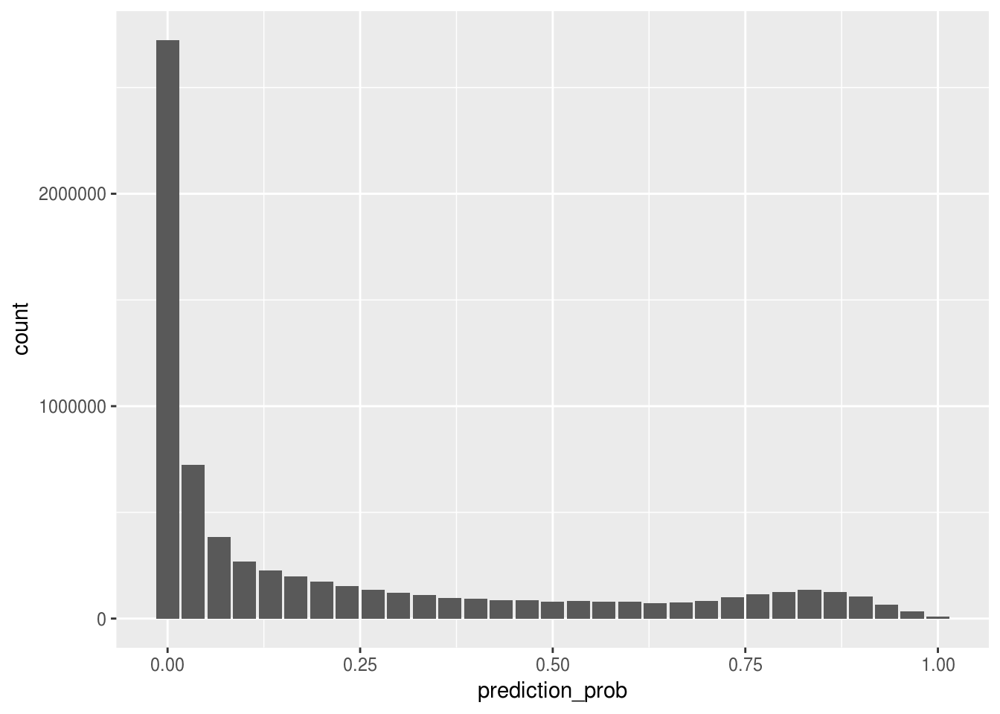
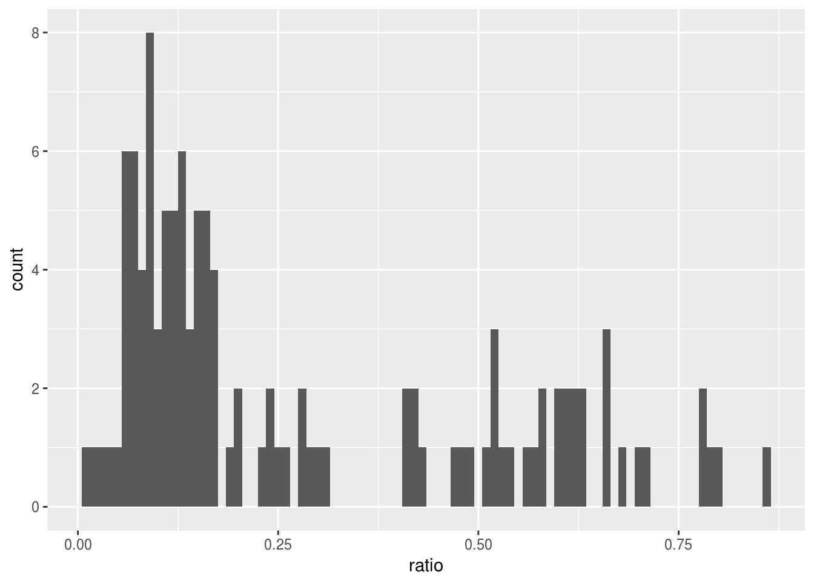
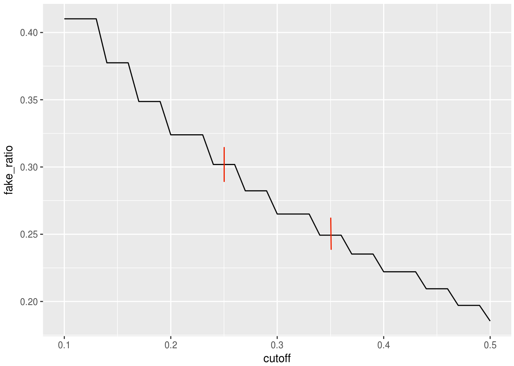
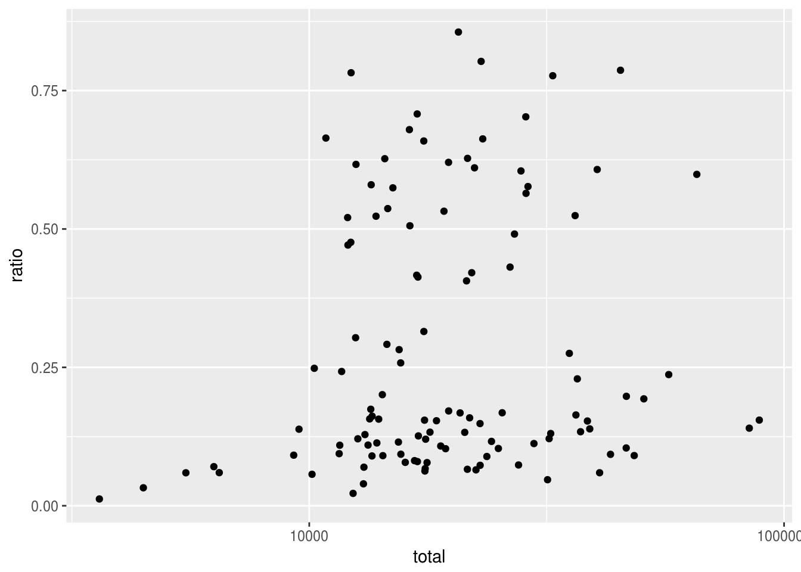
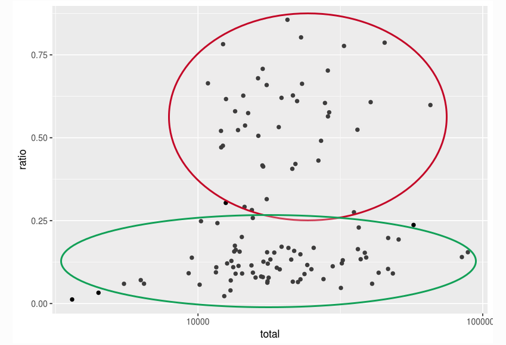

---  
title: "Identifying a Large Number of Fake Followers on Instagram"
author: "SRF Data, Jennifer Victoria Scurrell, Timo Grossenbacher (timo.grossenbacher@srf.ch)"
date: "October 2017"
output:
  html_document:
    code_folding: show
    echo: TRUE
    warning: FALSE
    message: FALSE
    theme: simplex
    df_print: kable
    toc: yes
    toc_depth: 4
    toc_float: 
      collapsed: false
      smooth_scroll: false
subtitle: A Statistical Learning Approach
---


```{r, echo = FALSE}
# CONFIG
user_name <- "srfdata" # github user name
project_name <- "2017-10-instagram-influencers" # adapt to new repo name
package_date <- "2017-06-01" # date of the CRAN snapshot that
# the checkpoint package uses
R_version <- "3.4.4" # R-Version to use
options(Ncpus = 4) # use 4 cores for parallelized installation of packages
if (R_version != paste0(version$major, ".", version$minor)){
  stop("ERROR: specified R version does not match currently used.")
}
```


*There have been quite some reports about high numbers of fake followers in the emerging influencer marketing business. However, we know of no systematic study that actually tried to thouroughly quantify the phenomenon. This journalistic investigation therefore sets out to quantify the amount of fake followers in a representative sample of Swiss Instagram influencers. It does that by training and employing a statistical model that has sufficient precision to reliably distinguish a fake from a real follower. The results show that fake followers are indeed a widespread phenomenon, as almost a third of approximately 7 million classified accounts appear to be fake – on average, the surveyed influencers have around 30% fake followers. Also, influencers with high ratios of fake followers seem to form a distinct cluster which stands apart from influencers with a "normal" base rate of fake followers.*

## Preliminary Remarks

This document illustrates the analysis supporting the articles on Instagram influencers, published on October 11th, 2017 and available on the [home page of SRF Data](https://www.srf.ch/data).

SRF Data attaches great importance to transparent and reproducible data preprocessing and -analysis. SRF Data believes in the principles of open data but also open and reproducible methods. Third parties should be empowered to build on the work of SRF Data and to generate new analyses and applications.

### R-Script & Processed Data

The analysis of the data was conducted in the [R project for statistical computing](https://www.r-project.org/). The RMarkdown script used to generate this document and all the resulting data can be downloaded under this [link](https://srfdata.github.io/`r project_name`/rscript.zip). Through executing `analysis.Rmd`, the herein described process can be reproduced and this document can be generated. In the course of this, data from the folder `ìnput` will be processed and results will be written into `output`.

**R version `r R_version`** is used. If the code does not work, it is very likely that an older R version is installed. If an error occures it sometimes helps to execute the script several times. Particularly in the case of package installation problems it could be helpful to restart the R session and execute the code over again. If necessary, third party libraries like `libgdal-dev` have to be installed.

*This report was generated on `r Sys.time()`. R version: `r paste0(version$major, ".", version$minor)` on `r version$platform`. For this report, CRAN packages as of `r package_date` were used.*

### GitHub

The code for the herein described process can also be freely downloaded from [https://github.com/srfdata/`r project_name`](https://github.com/srfdata/`r project_name`). Criticism in the form of GitHub issues and pull requests are very welcome!

### License

<a rel="license" href="http://creativecommons.org/licenses/by-sa/4.0/"></a>
<br /><span xmlns:dct="http://purl.org/dc/terms/" href="http://purl.org/dc/dcmitype/Dataset" property="dct:title" rel="dct:type">`r project_name`</span> by <a xmlns:cc="http://creativecommons.org/ns#" href="https://github.com/srfdata/`r project_name`" property="cc:attributionName" rel="cc:attributionURL">SRF Data</a> is licensed under a <a rel="license" href="http://creativecommons.org/licenses/by-sa/4.0/">Creative Commons Attribution-ShareAlike 4.0 International License</a>.

### Other Projects

All code & data from [SRF Data](https://srf.ch/data) are available under [https://srfdata.github.io](https://srfdata.github.io).

### Exclusion of Liability

The published information has been collated carefully, but no guarantee is offered of its completeness, correctness or up-to-date nature. No liability is accepted for damage or loss incurred from the use of this script or the information drawn from it. This exclusion of liability also applies to third-party content that is accessible via this offer.

## Preparations

```{r preparations, echo = FALSE, message = FALSE}
detach_all_packages <- function() {
  basic_packages_blank <-  c("stats",
                             "graphics",
                             "grDevices",
                             "utils",
                             "datasets",
                             "methods",
                             "base")
  basic_packages <- paste("package:", basic_packages_blank, sep = "")

  package_list <- search()[
    ifelse(unlist(gregexpr("package:", search())) == 1, TRUE, FALSE)]

  package_list <- setdiff(package_list, basic_packages)

  if (length(package_list) > 0)  for (package in package_list) {
    detach(package, character.only = TRUE, unload = TRUE)
    print(paste("package ", package, " detached", sep = ""))
  }
}

detach_all_packages()

# this allows multiple persons to use the same RMarkdown
# without adjusting the working directory by themselves all the time
source("scripts/csf.R")
path_to_wd <- csf() # if this - for some reason - does not work,
# replace with a hardcoded path, like so: "~/projects/rddj-template/analysis/"
if ( is.null(path_to_wd) | !dir.exists(path_to_wd)) {
  print("WARNING: No working directory specified for current user")
} else {
  setwd(path_to_wd)
}

# suppress scientific notation
options(scipen = 999)

# unload global rstudioapi and knitr again to avoid conflicts with checkpoint
# this is only necessary if executed within RStudio
# outside of RStudio, namely in the knit.sh script, this causes RMarkdown
# rendering to fail, thus should not be executed there
if (Sys.getenv("RSTUDIO") == "1"){
  detach_all_packages()
}
```

### Define Packages

```{r define packages, message = FALSE}
# from https://mran.revolutionanalytics.com/web/packages/
# checkpoint/vignettes/using-checkpoint-with-knitr.html
# all packages that will not be used can 
# be removed here (to only 'comment out' is not sufficient!)
# tidyverse: see https://blog.rstudio.org/2016/09/15/tidyverse-1-0-0/
cat("
library(tidyverse) # ggplot2, dplyr, tidyr, readr, purrr, tibble
library(magrittr) # pipes
library(stringr) # string manipulation
library(readxl) # excel
library(scales) # scales for ggplot2
library(foreach) # provides foreach looping construct for R
library(jsonlite) # json
library(forcats) # easier factor handling
library(lintr) # code linting, do not remove ;-)
library(rmarkdown) # for automatic knitting in deploy.sh
library(caret) # classification and regression training
library(e1071) # caret dependency
library(randomForest) # self-evident
library(Hmisc) # imputing missing values
library(epiR) # confidence interval of sensitivity, specificity, prediction",
file = "manifest.R")
```

### Install Packages

```{r install packages, message = FALSE, results = "hide"}
# if checkpoint is not yet installed, install it (for people using this
# system for the first time)
if (!require(checkpoint)) {
  if (!require(devtools)) {
    install.packages("devtools", repos = "http://cran.us.r-project.org")
    require(devtools)
  }
  devtools::install_github("RevolutionAnalytics/checkpoint",
                           ref = "v0.3.2", # could be adapted later,
                           # as of now (beginning of July 2017
                           # this is the current release on CRAN)
                           repos = "http://cran.us.r-project.org")
  require(checkpoint)
}
# nolint start
if (!dir.exists("~/.checkpoint")) {
  dir.create("~/.checkpoint")
}
# nolint end
# install packages for the specified CRAN snapshot date
checkpoint(snapshotDate = package_date,
           project = path_to_wd,
           verbose = T,
           scanForPackages = T,
           use.knitr = F,
           R.version = R_version)
rm(package_date)
```

### Load Packages

```{r load packages, message = FALSE, results = "hide"}
source("manifest.R")
unlink("manifest.R")
sessionInfo()
```

## 1. Introduction

Influencer marketing can be defined as a form of marketing that identifies individuals with influence over potential customers. In the past, brands have focused on celebrities and popular bloggers to promote their products and services. Nowadays, companies increasingly concentrate on *everyday* consumers that can have just as large an impact. This rather unprecedented generation of influencers predominantly operate on social media platforms like Instagram where an influencer's follower pool pertains as his or her main resource. 

Illustrative examples of Swiss Instagram influencers:

[adislittlecity](https://instagram.com/adislittlecity/)  
[oliviafaeh](https://instagram.com/oliviafaeh/)  
[_sylwina_](https://instagram.com/_sylwina_/)  
[dresslikesera](https://instagram.com/dresslikesera/)  
[sindiarifi](https://instagram.com/sindiarifi/)  

However, influencer marketing probably is an effective strategy only if the followers are genuine. Since a while, [reports](https://www.bloomberg.com/news/features/2016-11-30/confessions-of-an-instagram-influencer) [have](https://thenextweb.com/contributors/2017/08/27/influencer-marketing-trouble-fake-followers/#.tnw_zvgax0EZ) [been](https://www.marketingtechnews.net/news/2017/jul/17/fake-followers-and-influencer-marketing-ecosystem/) emerging about inadequate practices among influencers such as purchasing "fake" followers, e.g. bots (see our definition in 3). These can be bought on various websites such as [buzzoid.com](http://buzzoid.com), with prices normally varying between 5 and 15 $ per 1000 followers. 

Whatever the reason for the emergence of fake followers, up to date there has been no thorough, quantitative analysis of the scale of this phenomenon.

This analysis therefore seeks to **quantify the ratio of fake followers of a large number of Swiss influencers** by employing a standard statistical learning technique. 

## 2. Data Sources

Through this analysis, the **approximately 7 million unique followers** of **115 Swiss Instagram influencers** are inspected (in total roughly 8.5 million followers, as some followers follow more than one Swiss influencer). A list of hundred leading Swiss Instagram influencers was provided to us by [Le Guide Noir](https://leguidenoir.com/), a company specialised in influencer analytics. After further research and media reports, additional influencers are also taken into account. Celebrities (= people who are publicly known / famous independently of their social media activity) were removed from the list. For practical and privacy reasons, the exact list of analyzed followers is not made public herein. 

To gain a complete set containing all the followers of the specified influencers, as well as further necessary data (only available for public Instagram accounts, see 4.1 for handling of private accounts), the online service offered by [Magi Metrics](https://www.magimetrics.com/) is utilised. This paid service offers to export followers of a specified Instagram account into spreadsheets which can be downloaded and read into our processing workflow. 

### 2.1 Scraping of Private Accounts

As will be shown below, automatically classifying Instagram followers requires a level of so-called "features", such as the number of posts. [Magi Metrics](https://www.magimetrics.com/) supplies enough information for public Instagram accounts. However, information of private accounts have to be scraped additionally. We do this with the R package ['rvest'](https://cran.r-project.org/web/packages/rvest/rvest.pdf). Roughly one third of all followers to be classified are private accounts.

### 2.2 Time Range

The list of followers per influencer where gathered from Magi Metrics in the second half of August. The private accounts were scraped in the time between mid of August and mid of September. 

### 2.3 Completeness


Since scraping private accounts' key metrics from Instagram is a tedious process and some followers deleted their profile or stopped following an influencer, in the meantime, it was impossible to gather a complete list of *all* followers of a specific influencer at a given time. However, we managed to gather information of an average of **98.7%** followers per influencer. Overall, we managed to gather at least 95% of the followers for 113 influencers, for two influencers we surveyed only 94% of their followers. However, we still judge this almost complete sample to be representative of an influencer's follower base, especially given the high number of profiles analyzed.

## 3. Compiling a Training Set: Labelling Fake Followers

In order to train a **statistical learning model**, followers of the aforementioned Instagram influencers have to be **manually labelled as fake or real**.

The identification of a fake follower account underlies the hereinafter listed concuring features (a complete list can be found in section 4.1). Whether an account is labelled as fake or not underlies **our own judgement**. We judge a follower as fake, for example, if he or she follows an exorbitantly high number of other Instagram accounts, has almost no posts, no profile picture, if his or her account is held privately and the username contains many numbers. Sometimes all these criteria are fulfilled, sometimes only a combination of them. For inspiration, we also looked at [how](http://caleydimmock.com/instahacks-how-to-tell-fake-instagram-followers/) [others](https://www.business.com/articles/eric-samson-spot-fake-instagram-followers/) defined fake followers.

Examples of Instagram accounts we judge as "fake":

[milosz12345678](https://www.instagram.com/milosz12345678/)  
[johnatan41](https://www.instagram.com/johnatan41/)  
[andre003143](hhttps://www.instagram.com/andre003143/)  

Examples of Instagram accounts we judge as "real":

[vladagoose](https://www.instagram.com/vladagoose/)  
[jmaamichannel](https://www.instagram.com/maamichannel/)  
[natalya_anokhina](https://www.instagram.com/natalya_anokhina/)  

Company, advertisement or curation accounts are not considered as fake accounts if they don't have the above mentioned criteria fulfilled. Furthermore, the decision of labelling an account as fake is made **rather conservatively**.

A **stratified sample of 1000 followers** is prepared whereby out of ten randomly chosen influencers the 100 most recently affiliated followers are extracted. 25 followers were dismissed because their profiles did not longer exist (HTTP error 404).

This sample is labelled by hand through the double-verification principle, i.e. the followers are manually classified by two of us independently, the results discussed subsequently. Based on this first review of the data 10% of the followers can be identified as fake. 

## 4. Building a Random Forest

### 4.1 Feature Engineering

Already available features are:

| Attribute | Type | Description |
|---------------------|------|-----------------------------------|
| Number.of.followers | Numeric | Total amount of followers |
| Number.of.following | Numeric | Total amount of accounts this account is following |
| Number.of.posts | Numeric | Total number of media this account has posted |
| has_profile_picture | Factor w/ 2 Levels | Whether a profile picture is used (i.e. not using the default one), boolean |
| Private.account | Factor w/ 2 Levels | Whether the account is private, boolean |

To obtain more precise results, additional features are engineered:

| Attribute | Type | Description |
|---------------------|------|-----------------------------------|
| has_number | Factor w/ 2 Levels | Whether the account has a number somewhere in its username, e.g. "hans7891muster", "283874hans", "3hans345muster" |
| has_number_at_end | Factor w/ 2 Levels | Whether the account has a number at the end of its username, e.g. "hansmuster991818" but not "hans34muster" |
| alpha_numeric_ratio | Numeric | Ratio of alphabetic letters in username (variable name is a bit misleading), e.g. "1_3_hans" gives 0.5 |
| following_followers_ratio | Numeric | `Number.of.following / Number.of.followers`  |
| following_posts_ratio | Numeric | `Number.of.following / Number.of.posts` |
| followers_posts_ratio | Numeric | `Number.of.followers / Number.of.posts` |

```{r features, message = FALSE, results = "hide"}
# read in csv
data_complete <- read.csv(file = "input/labelled_1000_inclprivate.csv",
                          header = TRUE, stringsAsFactors = FALSE)

# adding more features
data <- data_complete %>%
  mutate(has_number =
           ifelse(grepl(pattern = "\\d", Username), "TRUE", "FALSE")) %>%
  mutate(has_number_at_end =
           ifelse(grepl(pattern = "\\d$", Username), "TRUE", "FALSE")) %>%
  mutate(alpha_numeric_ratio =
           lengths(regmatches(Username, gregexpr("[a-z]", Username))) /
           nchar(Username)) %>%
  mutate(following_followers_ratio =
           round( (as.numeric(Number.of.people.they.follow)) /
                   (as.numeric(Number.of.followers)), 7)) %>%
  mutate(following_posts_ratio =
           round( (as.numeric(Number.of.people.they.follow)) /
                   (as.numeric(Number.of.posts)), 7)) %>%
  mutate(followers_posts_ratio =
           round( (as.numeric(Number.of.followers)) /
                   (as.numeric(Number.of.posts)), 7))

# preprocess
data %<>%
  mutate(Number.of.posts = as.numeric(Number.of.posts),
         Number.of.people.they.follow =
           as.numeric(Number.of.people.they.follow),
         Number.of.followers = as.numeric(Number.of.followers),
         rating = as.factor(rating),
         has_profile_picture = as.factor(has_profile_picture),
         has_number = as.factor(has_number),
         has_number_at_end = as.factor(has_number_at_end),
         Private.account = as.factor(Private.account),
         alpha_numeric_ratio = as.numeric(alpha_numeric_ratio),
         following_followers_ratio = as.numeric(following_followers_ratio),
         followers_posts_ratio = as.numeric(followers_posts_ratio),
         following_posts_ratio = as.numeric(following_posts_ratio))
```

### 4.2 Imputation

As a consequence of the ratio calculations some features contain infinite values which have to be imputed. With the R package [`Hmisc`](https://cran.r-project.org/web/packages/Hmisc/Hmisc.pdf), infinite (not available = NAs) values can be substituted by a regression technique.

```{r imputation, message = FALSE, results = "hide"}

# replace infinite values with NA
data <- do.call(data.frame,
                lapply(data, function(x) replace(x, is.infinite(x), NA)))

# imputation of NAs
# imputed with Hmisc package
set.seed(778080)
f <- aregImpute(~ following_followers_ratio + following_posts_ratio +
                  followers_posts_ratio, data = data, n.impute = 10)

imputed <- impute.transcan(f, data = data, imputation = 1,
                          list.out = TRUE, pr = FALSE, check = FALSE)

# convert the list to the database
imputed.data <- as.data.frame(do.call(cbind, imputed))

data %<>%
  select(-following_followers_ratio, -following_posts_ratio,
         -followers_posts_ratio)

data <- cbind(data, imputed.data)
```

### 4.3 Performance Evaluation

The processed training data of 975 followers is split into two samples: The development sample (`dev`) is used to train the algorithm, the validation sample (`val`) is held out for estimating the performance of the model (sample segmentation: `dev` = 70% / `val` = 30%). We choose a Random Forest algorithm, as it has been shown to be a good model for binary classification in many different domains. The number of trees is set to 30 since with this setting, in this specific analysis, the most precise results can be obtained, as a previous, herein unspecified, analysis has shown.

```{r train algorithm, message = FALSE}

# prepare
data %<>%
  select(-Username, -Profile.URL)

# explore proportion false = real account / true = fake account
table(data$rating) / nrow(data)

# set seed for reproducibility
set.seed(432237)
# split the data sample into development and validation samples
# prob = segmentation sample1 = 0.7, sample2 = 0.3
sample.ind <- sample(2,
                     nrow(data),
                     replace = T,
                     prob = c(0.7, 0.3))
cross.sell.dev <- data[sample.ind == 1, ]
cross.sell.val <- data[sample.ind == 2, ]
 

# Create formula
varnames <- names(cross.sell.dev)
# Exclude ID or Response variable
varnames <- varnames[!varnames %in% c("rating")]
# Add + sign between exploratory variables
varnames1 <- paste(varnames, collapse = "+")
# Add response variable and convert to a formula object
rf.form <- as.formula(paste("rating", varnames1, sep = " ~ "))

# Building random forest
cross.sell.rf <- randomForest(rf.form,
                              cross.sell.dev,
                              ntree = 30,
                              importance = T)

cross.sell.rf
```

The following plot illustrates the importance of each included feature variable, according to our model. The more the accuracy of the random forest decreases due to the exclusion or permutation of a single variable, the more important that variable is considered. Variables with a large mean decrease in accuracy are more important for classification of the data. The mean decrease in Gini coefficient is a measure of how each variable contributes to the homogeneity of the nodes and leaves in the resulting random forest. Variables that result in nodes with higher purity have a higher decrease in the Gini coefficient.

The random forest algorithm identifies the following-posts-ratio, number of posts, and following-followers-ratio as the most discriminative features to identify and classify a fake Instagram account. In turn, whether the account is private or not seems to play a minor role.

```{r variable importance, message = FALSE}
# Variable Importance Plot
varImpPlot(cross.sell.rf,
           sort = T,
           main = "Variable Importance")
```


##### 4.4.1 Adjusting the Balance Between False Positives and False Negatives

The random forest attributes each classified follower a score in range `[0, 1]`. The default value of the cutoff is `0.5`, i.e. followers having been attributed a score higher than this value are classified as "fake". With this cutoff, we get a very high specificity (= low false-positive-rate, see below). This is crucial for our analysis because we want to have a very low chance of falsely accusing a follower to be "fake".


```{r prediction with threshold .5, message = FALSE}
# Predicting response variable / dev
cross.sell.dev$predicted.response <- predict(cross.sell.rf, cross.sell.dev)


# Predicting response variable / val
threshold <- .5

predictions <- predict(cross.sell.rf, cross.sell.val, type = "prob")

cross.sell.val$predicted.response <-
  factor(ifelse(predictions[, "TRUE"] > threshold, "TRUE", "FALSE"))
# cross.sell.val$predicted.response
cross.sell.val$prediction_prob <- predictions[, "TRUE"]
# Confusion matrix val
confusionMatrix(data = cross.sell.val$predicted.response,
                reference = cross.sell.val$rating,
                positive = "TRUE")

```
However, the sensitivity is very low with a cutoff of `0.5`. In order to reach a higher sensitivity (and so less false negatives), we are willing to sacrifice some of the specificity and lower the cutoff to `0.3`. 


```{r prediction with threshold .3, message = FALSE}

# Predicting response variable / val
threshold <- .3

cross.sell.val$predicted.response <-
  factor(ifelse(predictions[, "TRUE"] > threshold, "TRUE", "FALSE"))
# cross.sell.val$predicted.response
cross.sell.val$prediction_prob <- predictions[, "TRUE"]
# Confusion matrix val
confusionMatrix(data = cross.sell.val$predicted.response,
                reference = cross.sell.val$rating,
                positive = "TRUE")

rm(list = setdiff(ls(), "cross.sell.rf"))
```

analyzing explicitly the predicted outcome class "TRUE" which determines the classification label "fake", the test specificity (true positive rate) reveals that 96.3% of the "real" accounts are correctly identified as "real", which leaves us with **a false-positive-rate of 3.7%**, which we consider to be sufficiently low. This means that less than 4% of the accounts which are in fact "real" are falsely classified as "fake". Apart from that, the sensitivity (true negative rate) states that 77.4% of the accounts that are indeed "fake" are recognized as "fake", while 22.6% of them are missed. 

Applying the trained algorithm on the test set (`val`), it is able to predict fake followers with an accuracy of **91.2 - 96.7 (95% CI)%**. For this particular test set (given the above specified `seed`) and a cutoff value of `0.3`, the accuracy amounts to approximately **94.4%**. We are perfectly aware that a slightly different test set might result in slightly different values and that no cross-validation technique was used. However, given these very high numbers, we are confident that a slightly different model trained on a slightly different validation set would still be more than suited for analyzing the problem at hand. For instance, we would have still applied the model if the overall accuracy would be only as high as 90%, or if the false positive rate would be only as low as 10%. 

## 5. Classifying 7 Million Followers

The evaluated random forest is then applied to the full dataset of approximately 7 million followers. For practical & privacy reasons, this part of our analysis is **not publicly reproducible**. Yet, a random sample of 10'000 followers is provided below so the reader can evaluate the classification performance himself using 10 randomly selected accounts classified as "fake" and as "real", respectively. Upon each recompilation of the script, another 20 random accounts will be selected. 

```{r classifying, cache=FALSE}
load("input/random_sample_of_unclassified_followers.RData")

# prediction
prediction_prob <- predict(cross.sell.rf, random_sample_of_unclassified_followers, 
                           type = "prob")

random_sample_of_unclassified_followers$prediction_prob <- prediction_prob[, "TRUE"]

# prediction
threshold <- .3
prediction_prob <- predict(cross.sell.rf, random_sample_of_unclassified_followers, 
                           type = "prob")

random_sample_of_unclassified_followers$prediction_prob <- prediction_prob[, "TRUE"]

random_sample_of_unclassified_followers$predicted.response <-
  factor(ifelse(random_sample_of_unclassified_followers$prediction_prob >
                  threshold, "TRUE", "FALSE"))
```

### 5.1 Ten Randomly Selected Accounts Classified as "Fake"

```{r ten fake accounts, cache=FALSE}

random_sample_of_unclassified_followers %>%
  filter(predicted.response == "TRUE") %>%
  sample_n(10) %>% 
  arrange(desc(prediction_prob)) %>% 
  select(Profile.URL, prediction_prob, predicted.response) %>% 
  knitr::kable()

```

### 5.2 Ten Randomly Selected Accounts Classified as "Real"

```{r ten real accounts, cache=FALSE}
random_sample_of_unclassified_followers %>%
  filter(predicted.response == "FALSE") %>%
  sample_n(10) %>% 
  arrange(desc(prediction_prob)) %>% 
  select(Profile.URL, prediction_prob, predicted.response) %>% 
  knitr::kable()

```


## 6. Results

The following histogram shows the distribution of attributed scores per classified follower.



As you can see, a high number of followers are attributed a score close to zero. However, there is an almost uniform distribution for scores above `0.25` and a peak for scores `[0.75, 1]`. 

If we group these values by influencers and compute a fake ratio for each influencer (= ratio of followers having a score `>= 0.3`), we get the following distribution.


As you can see, most influencers have an overall fake ratio below 25%, then there is some sort of a gap, and then there are quite some influencers who have a fake ratio above 50% (approx. 30 influencers).

### 6.1 Ranges

The following key results will all be presented as ranges, not as point estimations. Please bear in mind that these are **not 95%-confidence-intervals**, as they [are apparently hard / impossible to calculate](https://stats.stackexchange.com/questions/299340/uncertainty-in-binary-classification-of-new-data-via-random-forest). 

Instead of confidence intervals, we obtain a low and high estimation of the overall fake ratio of an influencer by varying the cutoff (see 4.3) between `0.35` (= less followers are classified as "fake", which results in a higher false negative rate) and `0.25` (= more followers are classified as "fake", which results in a higher false positive rate) respectively. For those two cutoff values, we re-classify all 7 million followers and thus obtain two different fake ratios per influencer. We know that this is not a standard statistical technique, however we want to incorporate in our analysis the fact that the choice of the cutoff is somewhat arbitrary. Also, we want to **communicate uncertainty** in our estimations as we can not be perfectly sure about the exact number of fake followers per influencer – an exact number would wrongly suggest this, especially for laymen. After all, there are some sources of uncertainty, e.g. model performance which is good but not perfect, and the subjective definition of a fake follower. We could have also used cutoff values of `0.275` and `0.325` or any other arbitrary combination, but we think this choice is sensible. Also, we think the variation of the fake ratio as a function of the cutoff value is sufficiently limited, the sensibility thus acceptable.

Below you can see the variation of the overall fake ratio (6.2) dependent on the cutoff value. The stepped nature of the line is due to the limited number of trees in the random forest. The more trees, the smoother the line would be. Marked in red are the lower and upper cutoff value that was used to calculate the results.



### 6.2 Overall Fake Ratio

Our algorithm classifies **25.8 - 31.1% of all approximately 7 million followers of 115 Swiss influencers as fake**. 

### 6.3 Mean Fake Ratio per Influencer

If we take the unweighted mean of all fake ratios of all influencer, we can say: A Swiss Instagram influencer has, based on our subjective list of 115 influencers, on average **26.4 - 31.5% fake followers** (median: **14.3 - 19.6%**). 

### 6.4 Relationship Between Number of Followers and Fake Ratio

We also try to see whether there is an negative correlation between fake ratio and number of followers on the influencer level. We would expect that influencers with less followers have a higher ratio of fake followers, as these might be used to "boost" their early career. However, this is apparently not the case.



On the other hand, one could suspect a positive correlation by looking at the plot. This is not the case, however, as the following model output shows:

```
## 
## Call:
## lm(formula = ratio ~ total, data = predicted_response_by_influencer)
## 
## Residuals:
##     Min      1Q  Median      3Q     Max 
## -0.2692 -0.1801 -0.1199  0.2184  0.5756 
## 
## Coefficients:
##                   Estimate     Std. Error t value            Pr(>|t|)    
## (Intercept)  0.28144171411  0.02586137892  10.883 <0.0000000000000002 ***
## total       -0.00000002992  0.00000019264  -0.155               0.877    
## ---
## Signif. codes:  0 '***' 0.001 '**' 0.01 '*' 0.05 '.' 0.1 ' ' 1
## 
## Residual standard error: 0.2348 on 113 degrees of freedom
## Multiple R-squared:  0.0002134,  Adjusted R-squared:  -0.008634 
## F-statistic: 0.02412 on 1 and 113 DF,  p-value: 0.8769
```

## 7. Conclusions

First of all, we have shown that it is possible to train a statistical learning model that is able to predict whether an Instagram account is fake or not with very high precision. This depends – to some degree – on the definition of "fake". Our definition of "fake" is not definite and exact, it depends mainly on human intuition. However, since there is not a generally accepted definition of fake, we have to stick with ours, which might be translated to "an account that is likely not to be of any value for a company that advertises with an influencer this account follows, no matter whether he/she/it is a bot or a human being that does not belong to the target audience (e.g. someone having been hired for following a lot of accounts)". Further research into that business is needed in order to reach a common understanding of what is fake and what is not – and to which degree this damages the influencer marketing business.

Secondly we are suprised by the high number of fake followers in the business. Almost a third of 7 million followers of Swiss influencers appear to be fake. About 30 of the analyzed influencers appear to have more than 50% fake followers. Among those are quite some who advertise products of smaller and larger Swiss companies on a regular basis. We don't know and cannot confirm whether these fake followers were effectively purchased by these influencers themselves but the phenomenon seems to be widespread.

Having had a look at the distribution of the fake follower ratio per influencer as a function of the total number of followers, we can identify an even more revealing phenomenon. 



It seems that there are two distinct clusters of influencers in our dataset: One with all influencers having less than 25% fake accounts (green circle) and one with influencers having between 25 and 75% fake followers (red circle). In the first cluster, there seems to be a slightly positive correlation between the total number of followers and the amount of them that are fake. In the second cluster, this is not the case. Our theory is that the influencers in the first cluster are randomly followed by fake followers without previous action by the influencer – and influencers with a higher value of overall followers seem to "draw" more of these fake followers. In contrast, the influencers in the second cluster do not seem to belong to this class of influencers. Here, we suspect it is more likely that followers were actively procured, whether by the influencer him/herself or by a third party. Of course we don't have any proof for this, but our findings are in line with such a theory. 

A future study could try to look more deeply at key metrics of those second-cluster-influencers: engagement ratio and type of engagement to name a few. Quite possibly there are significant differences between the first and the second cluster.

A potential shortcoming of our analysis is the subjective compilation of our list of 115 influencers. We did our best to gain a representative sample of Swiss influencers by combining multiple sources of information, e.g. the list of "Le Guide Noir" and recommendations from experts in the field. However, it is possible that we missed key players and that our list also contains people a business professional would not classify as influencers in the marketing sense. With our publication on srf.ch we try to mitigate that by asking our audience to provide us with further names and/or corrections to our list. 


